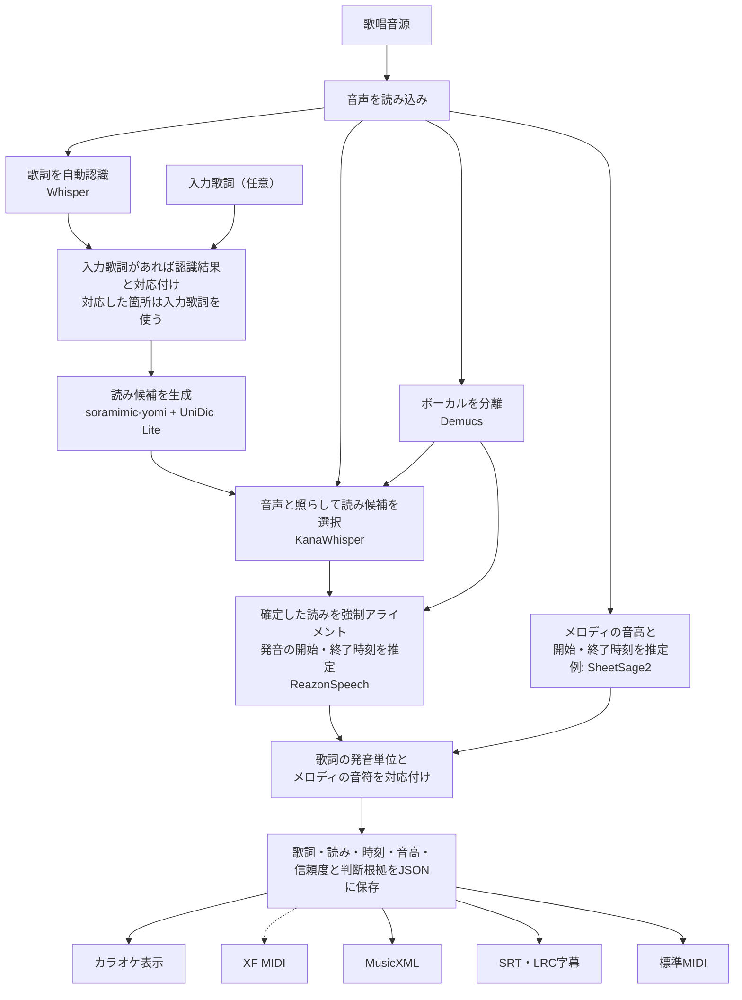

# Soramimic Score

歌っている音源から、**歌詞つきの音符データ**を作るためのPythonライブラリです。

歌詞、音の高さ、歌い始めと歌い終わりの時刻を一つのJSONにまとめます。このJSONを
もとに、ブラウザでのカラオケ表示、標準MIDI、MusicXML、字幕を作れます。
XF MIDIへの書き出しは今後の目標です。

## 処理の流れ



歌詞側の処理とメロディ側の処理は別々に行い、あとで対応付けます。正式な歌詞が
ある場合も自動認識を行い、音源との対応付けに使います。対応した箇所の読みは入力歌詞から決めます。
対応が取れない入力行は未解決として残し、歌われていないとは断定しません。必要なら、音源に合わせて
行を削除・補完するオプションも選べます。JSONを保存の中心にして、
各出力形式はJSONから作ります。点線のXF MIDI出力は今後追加する予定です。

読みは`soramimic-yomi`で生成し、UniDic Liteで別の候補を補います。
原音と分離したボーカルを比較して候補を選び、判断が曖昧なときは最初の読みを維持します。
発音時刻はボーカルから、歌詞本文とメロディは原音から推定します。

## 現在の状態

日本語の歌唱音源から歌詞・読み・時刻・音高を推定し、JSONに保存できます。
音声用の依存ライブラリとモデルの準備が必要です。認識結果には誤りが含まれるため、
利用前に確認してください。

歌詞認識や音高推定などのAIモデル本体は、用途に合わせて差し替えられるように
分離しています。モデルの重みは同梱しません。標準MIDI、MusicXML、SRT、LRCは
ブラウザから書き出せます。拍子やテンポは推定せず、書き出し時に固定の時間軸を使います。
XF MIDIへの書き出しは未対応です。

## 現在の使い方

### ブラウザで使う

音声モデルの依存とWeb用の依存を入れ、SheetSage2とMERTのディレクトリを指定します。
MP3などの読み込みにはFFmpegとFFprobeが必要です。音源・入力歌詞・解析結果は
`SORAMIMIC_SCORE_DATA`以下に保存され、完了または失敗から24時間を過ぎると
約5分間隔の掃除処理で削除されます。このディレクトリはGitの外に置いてください。

```sh
uv sync --extra audio --extra web
export SORAMIMIC_SCORE_SHEETSAGE_MODEL=/path/to/SheetSage2
export SORAMIMIC_SCORE_SHEETSAGE_BASE=/path/to/MERT-v2-FullSong
export SORAMIMIC_SCORE_DATA=/path/to/private-score-data
uv run --extra audio --extra web uvicorn soramimic_score.web:app --host 127.0.0.1 --port 8313 --no-access-log
```

MP3・M4A・WAV・FLAC・Ogg・WebMなどの音声を選択、ドロップ、またはブラウザで
録音できます。任意の入力歌詞を自動認識の結果に対応付けて解析します。
画面には歌詞認識、モーラ時刻、音高推定など現在の解析段階を表示します。
音源と同期したピアノロールとモーラ時刻を確認し、ブラウザ対応時は字幕入りWebM動画を
保存できます。Score JSON、標準MIDI、MusicXML、SRT、LRCをダウンロードできます。
入力歌詞を指定した場合、対応が確かな行の字幕にはその表記を使用します。
時刻が音声から得られなかったモーラは音符区間からの推定値です。
「VOICEVOXで歌い直す」を押すと、利用者が要求したジョブだけを波音リツの歌声で合成し、
元音源の時間軸に合わせて再生します。伴奏は含みません。VOICEVOX ENGINEが利用できる場合は
`SORAMIMIC_SCORE_VOICEVOX_URL`で接続先を指定できます（既定はローカルの50021番ポート）。
自動認識のクレジット風の行は、重なる歌唱音符があればその区間を短く再認識し、
歌詞が得られなければ除外します。正解歌詞に書かれた行は保持します。

公開用に`SORAMIMIC_SCORE_PUBLIC=1`を設定すると、UTC日付ごとにIPあたり100件まで
アップロードを受け付けます。ジョブIDは推測困難な値で、結果のURLを知る人だけが
取得できます。公開前にリバースプロキシ側でTLSとアップロード上限を設定してください。

### コマンドラインで使う

ソースを取得したディレクトリで音声用の依存をインストールします。Python 3.11を推奨します。
圧縮音声の入力にはFFmpegが必要です。
`soramimic-yomi`をGitから取得するため、Gitも必要です。

```sh
pip install '.[audio]'
```

[SheetSage2](https://huggingface.co/m-a-p/SheetSage2)と
[MERT-v2-FullSong](https://huggingface.co/m-a-p/MERT-v2-FullSong)は、利用条件を確認して
ローカルに用意してください。以下のパスは配置先の例です。

```sh
soramimic-score analyze song.mp3 \
  --sheetsage-model models/SheetSage2 \
  --sheetsage-base models/MERT-v2-FullSong \
  --output work/song.score.json
```

CPUで実行します。GPUを使う場合は`--device cuda`を付けます。
Whisper・Demucs・KanaWhisper・ReazonSpeechは初回使用時に取得します。取得済みのモデルだけを使う場合は
`--local-files-only`を付けてください。正式歌詞は`--lyrics lyrics.txt`で指定できます
（UTF-8、1行1フレーズ）。

### 歌詞を入力したときの読み

正式な歌詞を入力した場合も、**KanaWhisperによる読み候補の選択は標準で有効**です。
Whisperで歌われている区間を探し、入力歌詞と対応付けます。対応した箇所では、
入力歌詞から`soramimic-yomi`・UniDic Liteで読み候補を作ります。自動認識で出た
別の言葉の読みは候補に混ぜません。たとえば入力が「たちまち」なら、認識が
「たつまち」でも「タチマチ」を使います。

漢字などの読みが複数ある場合だけ音声で候補を選び、曖昧なときは入力歌詞側の
既定の読みを使います。`｜明日《あした》`のようなルビは指定どおりに読みます。
改行の分割・結合にも対応し、対応したまとまりの区間内で、**読みを確定してから
最終の強制アライメント**を行います。整列に失敗した場合はエラーにし、
自動認識の読みへ黙って戻すことはありません。未対応の認識行は自動認識のまま残します。

これは歌詞本文の削除・補完とは別の処理で、`--adjust-lyrics`を付けなくても行います。
KanaWhisperの認識文で入力歌詞を置き換えたり、辞書候補にない読みをそのまま採用したりはしません。
音声による読み選択を使わない場合は`--dictionary-readings`を指定してください。

### 入力歌詞を音源に合わせて削除・補完する

`--lyrics lyrics.txt --adjust-lyrics`を付けると、音声認識の結果と照合して、
歌われていない行を外し、繰り返しや不足する行を補います。指定しなければ
入力歌詞は変更しません。Pythonでは`analyze_audio(..., lyrics=lines, adjust_lyrics=True)`です。

このオプションでは、補正後の歌詞を使って読みと時刻を推定します。
認識ミスで入力歌詞を失う可能性があるため、既定はオフです。

補正は**行単位**です。対応する行は入力した表記のまま使い、行途中の言葉は
切り貼りしません。認識側の改行が異なる場合は、前後最大4行をまとめて照合します。
一行も対応が取れない場合は、入力を認識結果で置き換えずエラーにします。
認識ミスによって誤った削除・追加が起こり得るため、結果を確認してください。
元の入力、認識結果、採用した行、削除・補完の判断はJSONの`lyric-adjustment`根拠に残します。

### 音声モデルの設定

ボーカル分離と音声による読み選択は標準で有効です。不要な場合は、
`--no-vocal-separation`（原音で時刻を推定）や`--dictionary-readings`（音声比較をせず読みを生成）を
指定できます。分離済みの音声は一時ファイルとして扱い、解析終了時に削除します。
`--dictionary-readings`の場合も`soramimic-yomi`を使います。
Demucsの取得済み重みを指定する場合は、`--demucs-checkpoint models/955717e8-8726e21a.th`を
付けます。指定しなければPyTorchのモデルキャッシュを使います。

Pythonからは次のように実行します。

```python
from pathlib import Path
from soramimic_score import ModelConfig, analyze_audio, dump

config = ModelConfig(
    sheetsage_model=Path("models/SheetSage2"),
    sheetsage_base=Path("models/MERT-v2-FullSong"),
)
score = analyze_audio("song.wav", model_config=config)
dump(score, "work/song.score.json")
```

入力歌詞と対応付けた表示は、`lyric_surface(score)`から取得できます。
JSONでは`lyric-surface`根拠に、元の入力、対応する行のID、表示文字列、未対応行、
読み候補と選択結果を保存します。`canonical`は対応した入力歌詞と確定した読みを保持します。
認識側の行番号と最終的な歌詞の行番号は別に記録します。文字単位の時刻を推測して
入力表記へ割り当てることはしません。

```python
from soramimic_score import lyric_surface

score = analyze_audio("song.wav", model_config=config, lyrics=["青い空", "白い雲"])
display = lyric_surface(score)
print(display["display_text"])
```

認識済みの観測データがある場合は、モデルを実行せず変換できます。

```python
from soramimic_score import compile_score, dump

score = compile_score(observations)
dump(score, "song.score.json")
```

CLIからも同じ変換を実行できます。

```sh
soramimic-score --input observations.json --output song.score.json
```

入力JSONの形式や対応付けの詳細は、
[開発者向け説明](soramimic_score/README.md)を参照してください。

このリポジトリには、音源、完全な歌詞、MIDI、モデルの重み、ユーザーの
投稿データ、評価用正解データを含めません。

## ライセンス

本リポジトリのコードは[MIT](LICENSE)です。依存ライブラリ・辞書・モデルには
それぞれのライセンスが適用されます。標準構成のSheetSage2とMERT2には非商用条件が
あります。[外部ライブラリ・モデルの利用条件](THIRD_PARTY_NOTICES.md)を確認してください。
