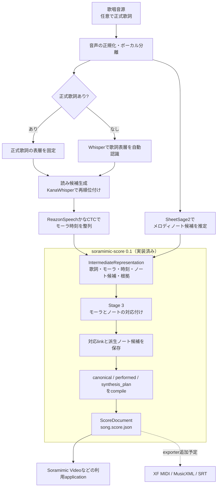

# Soramimic Score

Soramimic Scoreは、歌唱音源の認識結果を、持ち運び可能な一つのversioned JSONへ
変換するライブラリです。歌詞、読み、モーラ時刻、メロディのノート候補、対応付けの
判断、信頼度、根拠を保持し、不透明なMIDIへ平坦化しません。

現在の`0.1`パッケージは、Soramimic Videoから独立させた、音声モデルに依存しない
本番Stage 3コアです。音声の読み込み、歌詞の自動認識、モーラCTC、メロディ推定の
各adapterは、今後このリポジトリへ順次移します。それまでは、呼び出し側が正規化した
観測データを渡し、将来のend-to-end解析と同じJSON契約を受け取ります。

## 処理パイプライン



音声の正規化からノート候補推定までは、現在Soramimic Videoが担当し、
今後このリポジトリへ順次移します。実線は現在の処理経路、点線は今後
追加する派生exporterを示します。JSONを正本とし、各出力形式はJSONから
生成します。

```python
from soramimic_score import compile_score, dump

score = compile_score(observations)
dump(score, "song.score.json")
```

JSONのrootは`"format": "soramimic-score"`と、パッケージversionとは独立した整数の
`schema_version`で識別します。対応付け済みの観測と根拠に加えて、利用側が扱いやすい
`canonical`、`performed`、`synthesis_plan`の各score layerを含みます。

同じ変換処理をCLIからも利用できます。

```sh
soramimic-score --input observations.json --output song.score.json
```

このリポジトリには、音源、楽曲、完全な歌詞、MIDI、モデルweight、ユーザーの
upload、評価用正解データを含めません。
