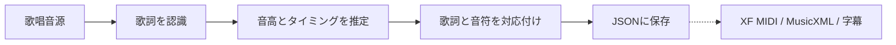

# Soramimic Score

歌っている音源から、**歌詞つきの音符データ**を作るためのPythonライブラリです。

歌詞、音の高さ、歌い始めと歌い終わりの時刻を一つのJSONにまとめます。このJSONを
もとに、カラオケ表示、XF MIDI、MusicXMLなどを作れるようにすることが目標です。

## 処理の流れ



正式な歌詞がある場合は、自動認識の代わりにその歌詞を使えます。

## 現在の状態

> **開発中:** 現在の`0.1`は、音源ファイルを直接解析する段階までは完成していません。

現在は、Soramimic Videoが認識した歌詞・音高・タイミングを受け取り、
それらを対応付けてJSONにまとめる部分が利用できます。音源の読み込みから
歌詞・音高を自動認識する部分も、今後このリポジトリへ移します。

## 現在の使い方

```python
from soramimic_score import compile_score, dump

score = compile_score(observations)
dump(score, "song.score.json")
```

CLIからも同じ変換を実行できます。

```sh
soramimic-score --input observations.json --output song.score.json
```

入力JSONの形式や対応付けの詳細は、
[開発者向け説明](soramimic_score/README.md)を参照してください。

このリポジトリには、音源、完全な歌詞、MIDI、モデルの重み、ユーザーの
投稿データ、評価用正解データを含めません。
