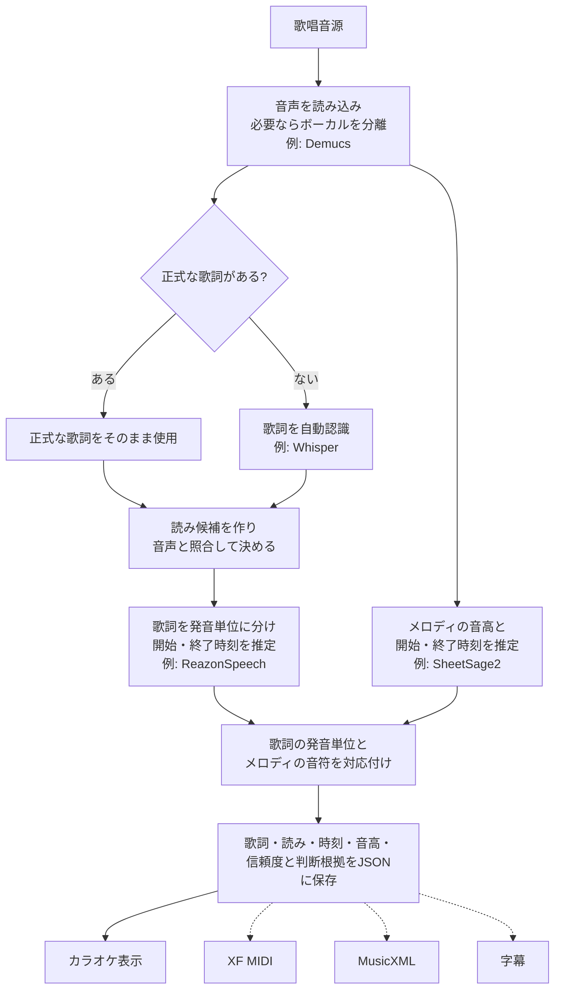

# Soramimic Score

歌っている音源から、**歌詞つきの音符データ**を作るためのPythonライブラリです。

歌詞、音の高さ、歌い始めと歌い終わりの時刻を一つのJSONにまとめます。このJSONを
もとに、カラオケ表示、XF MIDI、MusicXMLなどを作れるようにすることが目標です。

## 処理の流れ



歌詞側の処理とメロディ側の処理は別々に行い、あとで対応付けます。正式な歌詞が
ある場合は、自動認識で書き換えず、その歌詞を使います。JSONを保存の中心にして、
各出力形式はJSONから作ります。点線の出力は今後追加する予定です。

## 現在の状態

音源からJSONまでを順番に実行する部分と、歌詞・音符を対応付ける部分は実装済みです。

歌詞認識や音高推定などのAIモデル本体は、用途に合わせて差し替えられるように
分離しています。モデル本体は同梱せず、利用する環境から共通の入口へ接続します。

## 現在の使い方

```python
from soramimic_score import compile_score, dump

score = compile_score(observations)
dump(score, "song.score.json")
```

CLIからも同じ変換を実行できます。

```sh
soramimic-score --input observations.json --output song.score.json
```

音源から直接実行する場合は、歌詞認識・読み・タイミング・音高の各処理を
`AudioAdapters`として渡します。

```python
from soramimic_score import analyze_audio, dump

score = analyze_audio("song.wav", adapters)
dump(score, "song.score.json")
```

入力JSONの形式や対応付けの詳細は、
[開発者向け説明](soramimic_score/README.md)を参照してください。

このリポジトリには、音源、完全な歌詞、MIDI、モデルの重み、ユーザーの
投稿データ、評価用正解データを含めません。
