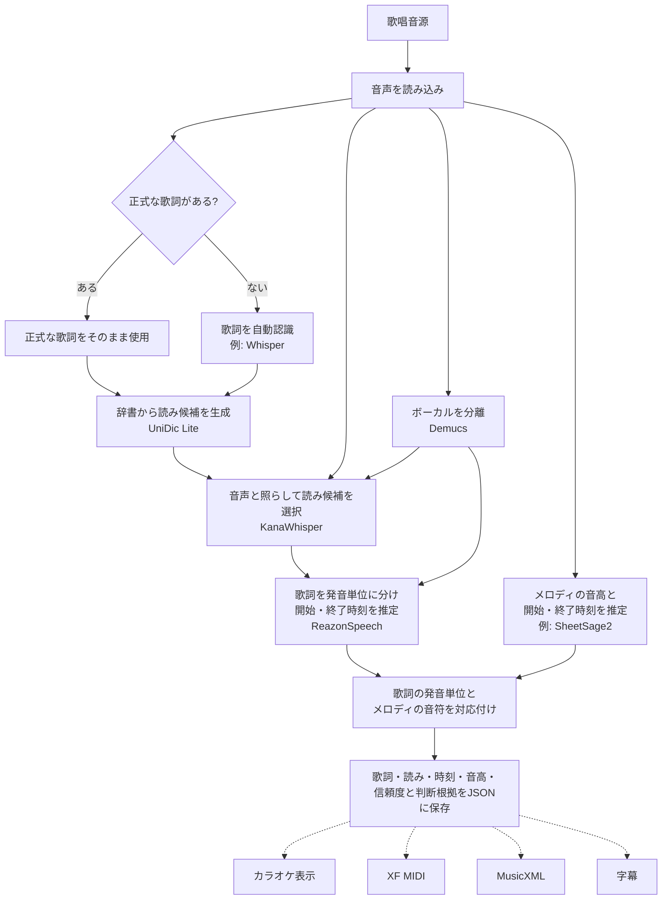

# Soramimic Score

歌っている音源から、**歌詞つきの音符データ**を作るためのPythonライブラリです。

歌詞、音の高さ、歌い始めと歌い終わりの時刻を一つのJSONにまとめます。このJSONを
もとに、カラオケ表示、XF MIDI、MusicXMLなどを作れるようにすることが目標です。

## 処理の流れ



歌詞側の処理とメロディ側の処理は別々に行い、あとで対応付けます。正式な歌詞が
ある場合は、自動認識で書き換えず、その歌詞を使います。JSONを保存の中心にして、
各出力形式はJSONから作ります。点線の出力は今後追加する予定です。

読みの選択では、原音と分離したボーカルを比較します。判断が曖昧なときは辞書の
読みを維持します。発音時刻はボーカルから、歌詞本文とメロディは原音から推定します。

## 現在の状態

日本語の歌唱音源から歌詞・読み・時刻・音高を推定し、JSONに保存できます。
音声用の依存ライブラリとモデルの準備が必要です。認識結果には誤りが含まれるため、
利用前に確認してください。

歌詞認識や音高推定などのAIモデル本体は、用途に合わせて差し替えられるように
分離しています。モデルの重みは同梱しません。XF MIDI・MusicXML・字幕への
書き出しは今後追加する予定です。

## 現在の使い方

ソースを取得したディレクトリで音声用の依存をインストールします。Python 3.11を推奨します。

```sh
pip install '.[audio]'
```

[SheetSage2](https://huggingface.co/m-a-p/SheetSage2)と
[MERT-v2-FullSong](https://huggingface.co/m-a-p/MERT-v2-FullSong)は、利用条件を確認して
ローカルに用意してください。以下のパスは配置先の例です。

```sh
soramimic-score analyze song.wav \
  --sheetsage-model models/SheetSage2 \
  --sheetsage-base models/MERT-v2-FullSong \
  --output work/song.score.json
```

CPUで実行します。GPUを使う場合は`--device cuda`を付けます。
Whisper・Demucs・KanaWhisper・ReazonSpeechは初回使用時に取得します。取得済みのモデルだけを使う場合は
`--local-files-only`を付けてください。正式歌詞は`--lyrics lyrics.txt`で指定できます
（UTF-8、1行1フレーズ）。

ボーカル分離と音声による読み選択は標準で有効です。不要な場合は、
`--no-vocal-separation`（原音で時刻を推定）や`--dictionary-readings`（辞書の読みのみ）を
指定できます。分離済みの音声は一時ファイルとして扱い、解析終了時に削除します。
Demucsの取得済み重みを指定する場合は、`--demucs-checkpoint models/955717e8-8726e21a.th`を
付けます。指定しなければPyTorchのモデルキャッシュを使います。

Pythonからは次のように実行します。

```python
from pathlib import Path
from soramimic_score import ModelConfig, analyze_audio, dump

config = ModelConfig(
    sheetsage_model=Path("models/SheetSage2"),
    sheetsage_base=Path("models/MERT-v2-FullSong"),
)
score = analyze_audio("song.wav", model_config=config)
dump(score, "work/song.score.json")
```

認識済みの観測データがある場合は、モデルを実行せず変換できます。

```python
from soramimic_score import compile_score, dump

score = compile_score(observations)
dump(score, "song.score.json")
```

CLIからも同じ変換を実行できます。

```sh
soramimic-score --input observations.json --output song.score.json
```

入力JSONの形式や対応付けの詳細は、
[開発者向け説明](soramimic_score/README.md)を参照してください。

このリポジトリには、音源、完全な歌詞、MIDI、モデルの重み、ユーザーの
投稿データ、評価用正解データを含めません。

## ライセンス

本リポジトリのコードは[MIT](LICENSE)です。依存ライブラリ・辞書・モデルには
それぞれのライセンスが適用されます。標準構成のSheetSage2とMERT2には非商用条件が
あります。[外部ライブラリ・モデルの利用条件](THIRD_PARTY_NOTICES.md)を確認してください。
