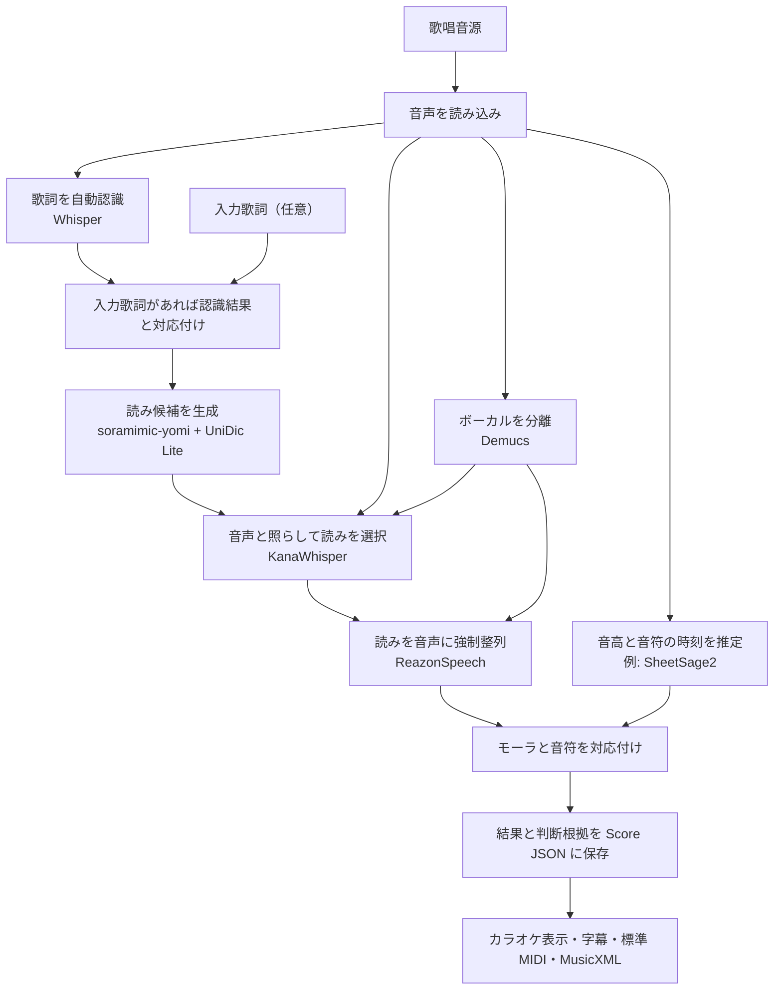

# Soramimic Score

Soramimic Score は、歌唱音源から歌詞、読み、モーラ（「きゃ」「ん」などの発音単位）の時刻、音符を推定する Python ライブラリです。
推定結果と判断根拠を一つの **Score JSON** に保存します。
ブラウザでは、音源と同期したピアノロールやカラオケ字幕を確認でき、標準 MIDI、MusicXML、SRT、LRC に書き出せます。

日本語の歌唱音源を対象とします。
歌詞や音高の推定には誤りがあり得るため、出力を利用する前に音源と照合してください。
拍子とテンポは推定せず、楽譜形式への書き出しには固定の時間軸を使います。
XF MIDI への書き出しは未対応です。

## 処理の流れ



歌詞とメロディを別々に推定し、最後にモーラと音符を対応付けます。
入力歌詞がある場合も Whisper で歌唱区間を探し、認識結果と入力歌詞を対応付けます。
対応した箇所では入力歌詞の表記から読みを決め、その読みを音声に整列します。
対応が取れない入力行は未解決として記録し、歌われていないとは断定しません。

読み候補は `soramimic-yomi` で作り、UniDic Lite で別の候補を補います。
原音と分離したボーカルを比較して候補を選び、音声から判断できなければ既定の読みを維持します。
モーラの時刻は主に分離したボーカルから、音符は原音から推定します。
歌詞認識や音高推定のモデルは交換できる構成で、モデルの重みは同梱しません。

## ブラウザで使う

Python 3.11 以降、Git、音声モデル、FFmpeg、FFprobe を用意します。
SheetSage2 と MERT-v2-FullSong は、利用条件を確認してローカルに配置してください。
次のパスは配置先の例です。

```sh
uv sync --extra audio --extra web
export SORAMIMIC_SCORE_SHEETSAGE_MODEL=/path/to/SheetSage2
export SORAMIMIC_SCORE_SHEETSAGE_BASE=/path/to/MERT-v2-FullSong
export SORAMIMIC_SCORE_DATA=/path/to/private-score-data
uv run --extra audio --extra web uvicorn soramimic_score.web:app --host 127.0.0.1 --port 8313 --no-access-log
```

ブラウザから MP3、M4A、WAV、FLAC、Ogg、WebM などの音声を選択、ドロップ、または録音できます。
正解歌詞の入力は任意です。
解析中は歌詞認識、モーラ時刻、音高推定などの段階を表示します。
結果画面では音源と同期したピアノロールや字幕を確認でき、ブラウザが対応していれば字幕入り WebM 動画も保存できます。
Score JSON、標準 MIDI、MusicXML、SRT、LRC もダウンロードできます。
入力歌詞と対応が取れた行には、その歌詞の表記を使います。
音声から時刻を得られなかったモーラには、音符区間から推定した時刻を使います。

「PrettyPitch で歌い直す」を押すと、推定した音符と歌詞から波音リツの歌声を合成し、分離した伴奏と重ねて再生します。
`SORAMIMIC_SCORE_AUTO_RESING=1` を設定すると、解析後に自動で合成します。
合成に失敗した場合も解析結果は表示され、結果画面から再試行できます。
公開環境の初期設定では手動合成です。
歌い直しには外部の PrettyPitch、LeapSinger、各モデルが必要です。
実行環境は `PRETTYPITCH_ROOT`、`PRETTYPITCH_PYTHON`、`PRETTYPITCH_LEAPSINGER_ROOT`、`PRETTYPITCH_DEVICE` で指定します。
歌声モデルとボコーダの利用条件も確認してください。

音源、入力歌詞、解析結果は `SORAMIMIC_SCORE_DATA` 以下に保存します。
この保存先は Git リポジトリの外に置いてください。
ジョブの完了または失敗から 1 時間を過ぎると、約 5 分間隔の掃除処理で削除します。
結果画面からすぐに削除することもできます。
結果の URL を知る人は保存中の結果を取得できるため、共有する場合は注意してください。

公開用に `SORAMIMIC_SCORE_PUBLIC=1` を設定すると、UTC の日付ごとに IP アドレスあたり 100 件までアップロードを受け付けます。
公開前にリバースプロキシで TLS とアップロード上限を設定してください。

## コマンドラインで使う

Python 3.11 以降と Git を用意します。
圧縮音声を入力する場合は FFmpeg も必要です。
ソースを取得したディレクトリで、音声用の依存ライブラリをインストールします。

```sh
pip install '.[audio]'
```

[SheetSage2](https://huggingface.co/m-a-p/SheetSage2) と [MERT-v2-FullSong](https://huggingface.co/m-a-p/MERT-v2-FullSong) は、利用条件を確認してローカルに配置してください。
以下のパスは配置先の例です。

```sh
soramimic-score analyze song.mp3 \
  --sheetsage-model models/SheetSage2 \
  --sheetsage-base models/MERT-v2-FullSong \
  --output work/song.score.json
```

既定では CPU を使います。
GPU を使う場合は `--device cuda` を指定してください。
Whisper、Demucs、KanaWhisper、ReazonSpeech は初回使用時に取得します。
取得済みのモデルだけを使う場合は `--local-files-only` を指定します。
入力歌詞は `--lyrics lyrics.txt` で指定できます。
ファイルは UTF-8 で、1 行を 1 フレーズとします。

### 入力歌詞の読み

入力歌詞と認識結果が対応した箇所では、入力歌詞を最終的な歌詞として使います。
認識結果に別の言葉が含まれていても、その読みを入力歌詞の候補には混ぜません。
たとえば入力が「たちまち」で認識結果が「たつまち」の場合、読みは「タチマチ」です。

漢字などに複数の読みがある場合は、既定で KanaWhisper の結果を使って候補を選びます。
音声から判断できなければ、入力歌詞側の既定の読みを使います。
`｜明日《あした》` のようにルビを指定した箇所は、その読みを使います。
音声による候補の選択を省く場合は `--dictionary-readings` を指定してください。

認識結果と入力歌詞の改行位置が異なっていても、対応したまとまりの中で読みを決めてから最終的な強制整列を行います。
整列に失敗した場合はエラーを返し、認識結果の読みへ自動では戻しません。
対応しない認識行は自動認識の結果として残します。
この読みの処理は `--adjust-lyrics` を指定しなくても行います。

自動認識でクレジットに似た行が出た場合は、同じ区間に歌唱音符があれば短く再認識します。
歌詞が得られなければその行を除外しますが、入力歌詞に書かれた行は保持します。

### 入力歌詞を音源に合わせて調整する

`--lyrics lyrics.txt --adjust-lyrics` を指定すると、認識結果との照合に基づいて、歌われていないと判断した行を外し、繰り返しや不足する行を補います。
指定しなければ入力歌詞の行を削除・補完しません。
認識ミスによる誤った削除や追加を避けるため、このオプションは初期設定で無効です。

調整は行単位で行い、行の途中の言葉は切り貼りしません。
認識結果と改行位置が異なる場合は、前後最大 4 行をまとめて照合します。
入力歌詞のどの行も対応付けられない場合は、認識結果で置き換えずエラーを返します。
元の入力、認識結果、採用した行、削除・補完の判断は Score JSON の `lyric-adjustment` 根拠に残します。
調整後の歌詞で読みと時刻を推定するため、結果を音源と照合してください。

Python からは `analyze_audio(..., lyrics=lines, adjust_lyrics=True)` と指定します。

### 音声モデルの設定

ボーカル分離と音声による読みの選択は初期設定で有効です。
原音から発音時刻を推定する場合は `--no-vocal-separation` を指定します。
音声で読みを比較せず辞書の候補を使う場合は `--dictionary-readings` を指定します。
どちらの場合も `soramimic-yomi` は読みの生成に使います。
分離した音声は一時ファイルとして扱い、解析終了時に削除します。

Demucs の取得済み重みを指定する場合は、`--demucs-checkpoint models/955717e8-8726e21a.th` を追加します。
指定しなければ PyTorch のモデルキャッシュを使います。

## Python から使う

`analyze_audio` で音源を解析し、`dump` で Score JSON を保存します。

```python
from pathlib import Path
from soramimic_score import ModelConfig, analyze_audio, dump

config = ModelConfig(
    sheetsage_model=Path("models/SheetSage2"),
    sheetsage_base=Path("models/MERT-v2-FullSong"),
)
score = analyze_audio("song.wav", model_config=config)
dump(score, "work/song.score.json")
```

入力歌詞を渡した場合は、`lyric_surface(score)` から表示用の歌詞と対応付けの結果を取得できます。
Score JSON の `lyric-surface` 根拠には、元の入力、対応する行の ID、表示文字列、未対応行、読み候補と選択結果を保存します。
`canonical` は対応した入力歌詞と確定した読みを保持します。
認識時と最終結果の行番号は別々に記録します。
文字単位の時刻を推測して入力歌詞へ割り当てることはしません。

```python
from soramimic_score import lyric_surface

score = analyze_audio("song.wav", model_config=config, lyrics=["青い空", "白い雲"])
display = lyric_surface(score)
print(display["display_text"])
```

認識済みの観測データから Score JSON を作る場合は、音声モデルを実行せずに変換できます。

```python
from soramimic_score import compile_score, dump

score = compile_score(observations)
dump(score, "song.score.json")
```

同じ変換を CLI から行う場合は、次のコマンドを使います。

```sh
soramimic-score --input observations.json --output song.score.json
```

入力 JSON の形式と対応付けの詳細は、[開発者向け説明](soramimic_score/README.md)を参照してください。
このリポジトリには、音源、完全な歌詞、MIDI、モデルの重み、ユーザーの投稿データ、評価用正解データを含めません。

## ライセンス

本リポジトリのコードには [MIT ライセンス](LICENSE)を適用します。
依存ライブラリ、辞書、モデルにはそれぞれの利用条件が適用されます。
標準構成の SheetSage2 と MERT-v2-FullSong には非商用条件があります。
詳細は[外部ライブラリ・モデルの利用条件](THIRD_PARTY_NOTICES.md)を確認してください。
